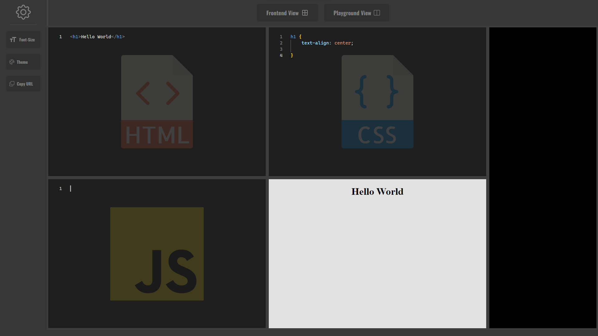

# Cody

A playground to test your JavaScript, CSS, and HTML skills.

### Features

- [Coding in JS, CSS, and HTML] - Users can write and edit their JavaScript, CSS, and HTML code all in one place. It's your canvas for web development.

- Live Website Preview: - See your website come to life instantly! As you code, you can view the changes in real-time, making it easy to test and refine your design.

Console Interaction: - Debugging is a breeze. The console is right there, ready to display error messages, logs, and responses, helping you perfect your code.

Customization: - Tailor your coding experience to your liking. You can change the theme and font size to match your preferences, ensuring a comfortable and visually appealing environment.

Dual Viewing Modes: - Switch between the frontend view (to see your website) and the playground view (for JavaScript editing and console), allowing you to focus on what matters most at any given moment.

URL Sharing: - Need to share your creation with others? A single click allows you to copy the URL, making it simple to showcase your work to colleagues or friends.

Data Storage: - For added convenience and security, your content can be saved to a MongoDB database. This ensures that your work is safe and accessible from anywhere, anytime, by shortening links and providing you with an organized repository of your projects.

